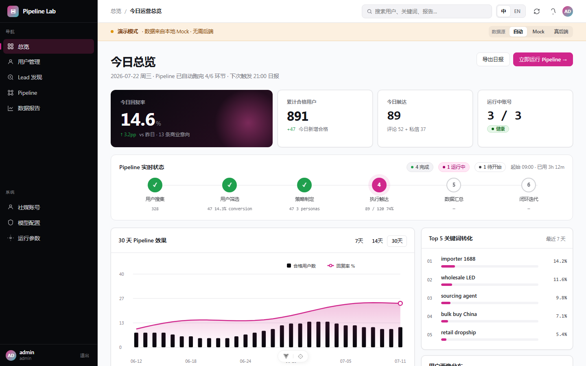
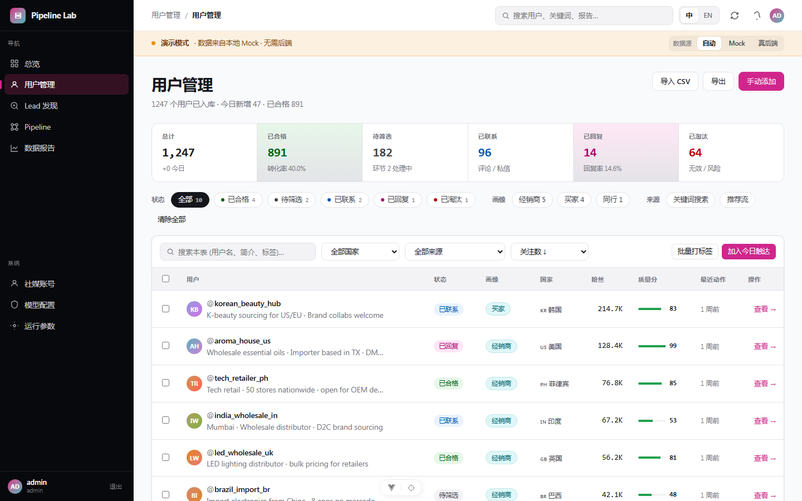
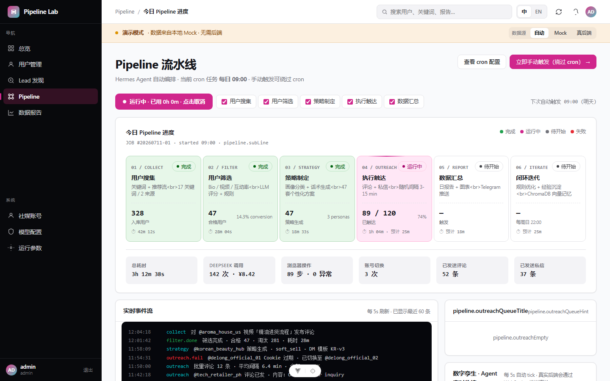
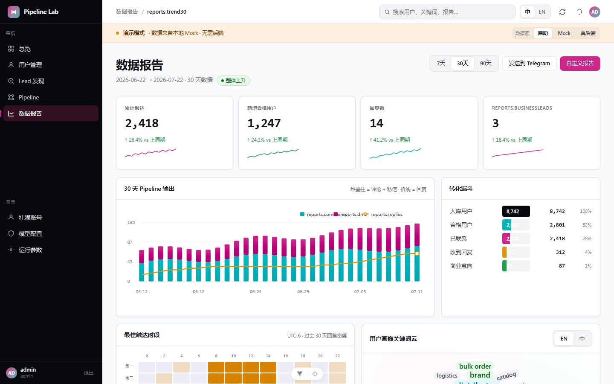
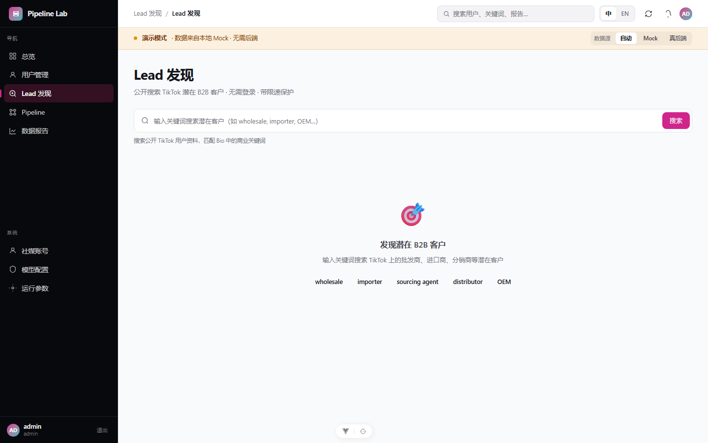
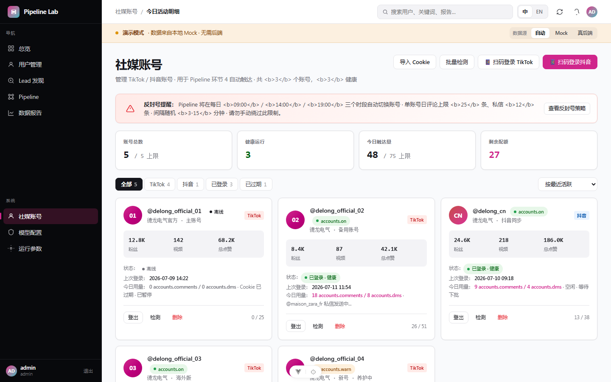
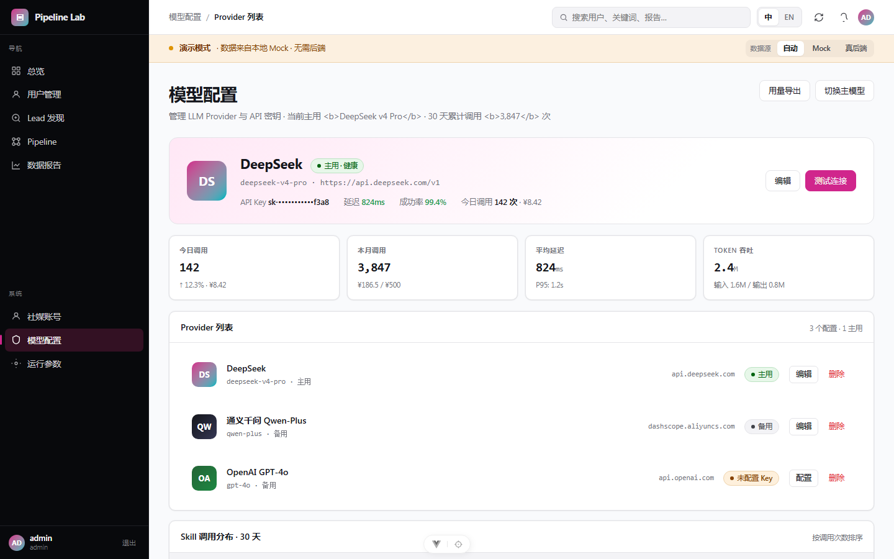
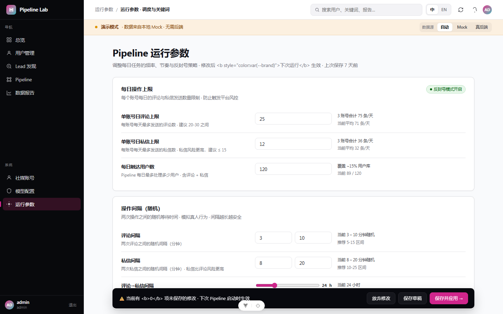

# TikTok B2B 业务拓展机器人

> 面向越南等海外 B2B 市场的 TikTok 自动获客系统
> Hermes Agent 主控 · DeepSeek v4 Pro · Playwright 浏览器自动化


---

## 这是什么

一个**面向德龙电气等中国外贸 B2B 企业**的 TikTok 自动获客机器人。

系统每天自动完成 6 环节流水线：**搜集 → 筛选 → 策略 → 触达 → 汇总 → 迭代**

识别越南等海外市场潜在 B2B 客户并自动私信推广，支持 **TikTok（国际版）+ 抖音（中国版）** 双平台。

---

## 核心特性

### 双平台支持

| 平台 | 域名 | 登录方式 | 状态 |
|------|------|---------|------|
| TikTok 国际版 | tiktok.com | QR 扫码 | ✅ 已支持 |
| 抖音中国版 | douyin.com | QR 扫码 | ✅ 已支持 |

### 6 环节 Pipeline

```
┌──────────┐  ┌──────────┐  ┌──────────┐  ┌──────────┐  ┌──────────┐  ┌──────────┐
│ 环节 1   │─▶│ 环节 2   │─▶│ 环节 3   │─▶│ 环节 4   │─▶│ 环节 5   │─▶│ 环节 6   │
│ 用户搜集 │  │ 用户筛选 │  │ 策略制定 │  │ 执行触达 │  │ 数据汇总 │  │ 闭环迭代 │
└──────────┘  └──────────┘  └──────────┘  └──────────┘  └──────────┘  └──────────┘
  关键词搜索    Bio 评分      画像分类       评论+私信      日报生成      经验沉淀
  推荐流抓取    LLM 精筛      话术生成       随机间隔       Telegram     ChromaDB
  竞品分析      预筛过滤      执行计划       反封号策略     趋势图表     规则优化
```

### 三层接口

```
┌─────────────────────────────────────────────────────────────┐
│                    Web UI (Vue 3)                           │
│  Dashboard · Users · Leads · Pipeline · Reports · Config    │
└─────────────────────────┬───────────────────────────────────┘
                          │ HTTP
┌─────────────────────────▼───────────────────────────────────┐
│                  REST API (FastAPI)                          │
│              31 个端点 · JWT 认证 · CORS                     │
└─────────────────────────┬───────────────────────────────────┘
                          │
┌─────────────────────────▼───────────────────────────────────┐
│                   Core 业务逻辑层                            │
│  ┌─────────┐ ┌──────────┐ ┌──────────┐ ┌─────────────────┐ │
│  │ Models  │ │ Storage  │ │ Services │ │ Plugins         │ │
│  │ (ORM)   │ │(SQLite + │ │(Pipeline │ │(Collector/      │ │
│  │ 9 张表  │ │ChromaDB) │ │ Auth)    │ │ Channel/Filter) │ │
│  └─────────┘ └──────────┘ └──────────┘ └─────────────────┘ │
└─────────────────────────────────────────────────────────────┘
```

---

## 界面预览

### Dashboard — 今日概览



KPI 卡片（总用户 / 合格 / 今日新增 / 回复率）+ 30 天趋势图 + Pipeline 状态 + 词云

### Users — 用户管理



分状态列表 + 多维筛选（状态/画像/来源/国家/关键词）+ CSV 导入导出 + 手动添加

### Pipeline — 流水线编排



6 阶段卡片（搜集→筛选→策略→触达→汇总→迭代）+ 实时事件流 + 触达队列

### Reports — 数据报告



转化漏斗 + 地区分布 + 情感分析 + 30 天趋势 + 自定义报告

### Leads — 潜在客户发现



关键词搜索 TikTok 公开用户 + 相关度评分 + 一键入库

### Accounts — 账号管理



QR 扫码登录 + 批量 Cookie 检测 + 账号上限控制（最多 5 个）

### LLM — 模型配置



多 Provider 管理（DeepSeek / Qwen / OpenAI）+ 测试连接 + 使用统计

### Runtime — 运行参数



每日限速 + 随机间隔 + cron 调度 + 关键词库管理

---

## 架构图

> 使用 draw.io 绘制，源文件在 `docs/diagrams/`

| 图 | 文件 | 内容 |
|---|------|------|
| 系统架构 | [architecture.drawio](docs/diagrams/architecture.drawio) | 三层模型 + 外部服务 |
| Pipeline 流程 | [pipeline.drawio](docs/diagrams/pipeline.drawio) | 6 环节执行流 |
| 数据库 ER | [database-er.drawio](docs/diagrams/database-er.drawio) | 6 张核心表关系 |

---

## 技术栈

| 层 | 技术 | 用途 |
|---|------|------|
| **后端** | Python 3.11+ / FastAPI | REST API 服务（31 端点） |
| **ORM** | SQLAlchemy 2.0 | 数据库抽象（9 张表） |
| **向量存储** | ChromaDB | 用户画像语义搜索 |
| **浏览器** | Playwright | TikTok/抖音自动化操作 |
| **LLM** | DeepSeek v4 Pro | 用户筛选 / 策略生成 |
| **前端** | Vue 3 + Element Plus | 管理面板（11 页面） |
| **图表** | ECharts | 趋势图 / 分布图 |
| **数据库** | SQLite | 本地持久化存储 |
| **通知** | Telegram Bot | 日报推送 |

---

## 快速启动

### 环境要求

- Python 3.11+
- Node.js 18+
- Playwright Chromium

### 安装

```bash
git clone https://github.com/tienan2024/tiktok-b2b-bot.git
cd tiktok-b2b-bot

pip install -r requirements.txt -i https://pypi.tuna.tsinghua.edu.cn/simple
playwright install chromium

cd tiktok_bot_console/ui
npm install --registry https://registry.npmmirror.com
```

### 配置

```bash
cp .env.example .env
# 编辑 .env: DEEPSEEK_API_KEY=sk-xxx
```

### 启动

```bash
# 终端 1：后端
python -m uvicorn tiktok_bot_api.main:app --reload --port 8000

# 终端 2：前端
cd tiktok_bot_console/ui && npm run dev
```

- 前端: http://localhost:5173
- API 文档: http://localhost:8000/docs

---

## 项目结构

```
tiktok-bot-software/
├── tiktok_bot_api/              # FastAPI REST 后端 (31 端点)
├── tiktok_bot_core/             # 业务核心层
│   ├── models/entities.py       # 9 张 SQLAlchemy ORM 表
│   ├── services/
│   │   ├── pipeline.py          # 6 环节 Pipeline 编排
│   │   └── auth_service.py      # QR 登录 + Cookie 管理
│   ├── plugins/                 # Collector / Channel / Filter
│   └── platforms.py             # 双平台抽象 (TikTok + 抖音)
├── tiktok_bot_console/ui/       # Vue 3 前端 (11 页面)
├── tests/                       # 36 个后端测试
├── skills/                      # 4 个 Hermes Skills
└── docs/                        # 14 篇 wiki + 截图 + 架构图
```

---

## API 端点 (31 个)

<details>
<summary>点击展开</summary>

| 方法 | 路径 | 说明 |
|------|------|------|
| GET | `/api/health` | 健康检查 |
| POST | `/api/auth/login` | 登录 |
| POST | `/api/auth/register` | 注册 |
| GET | `/api/users` | 用户列表 |
| GET | `/api/users/stats` | 用户统计 |
| GET | `/api/users/{username}/detail` | 用户画像 |
| POST | `/api/users` | 手动添加用户 |
| POST | `/api/pipeline/run` | 启动 Pipeline |
| GET | `/api/pipeline/events` | 事件历史 |
| GET | `/api/pipeline/overview` | Pipeline 总览 |
| GET | `/api/reports/daily` | 日报 |
| GET | `/api/reports/trend` | 趋势 |
| GET | `/api/reports/overview` | 漏斗+地区+情感 |
| GET | `/api/config` | 配置列表 |
| PUT | `/api/config/{key}` | 更新配置 |
| GET | `/api/stats/dashboard` | Dashboard |
| GET | `/api/accounts` | 账号列表 |
| POST | `/api/accounts` | 添加账号 |
| DELETE | `/api/accounts/{id}` | 删除账号 |
| POST | `/api/accounts/login-qrcode` | QR 登录 |
| GET | `/api/accounts/login-status` | 登录状态 |
| GET | `/api/leads/search` | Lead 搜索 |
| GET | `/api/llm/providers` | LLM 配置 |

</details>

---

## 测试

```bash
python -m pytest tests/ -v
```

```
tests/test_core.py           ✅ 10 passed
tests/test_plugins.py        ✅ 8 passed
tests/test_pipeline.py       ✅ 5 passed
tests/test_platforms_auth.py ✅ 13 passed
─────────────────────────────────────
Total                        ✅ 36 passed
```

---

## 文档

| 文档 | 内容 |
|------|------|
| [01 — 项目概述](docs/wiki/01-项目概述.md) | 核心目标、技术栈 |
| [02 — 架构设计](docs/wiki/02-架构设计.md) | 三层模型 |
| [05 — Pipeline](docs/wiki/05-Pipeline.md) | 6 环节流程 |
| [10 — 账号管理](docs/wiki/10-账号管理.md) | QR 登录 |
| [11 — 双平台](docs/wiki/11-双平台支持.md) | TikTok + 抖音 |

---

## 许可证

MIT License

## 致谢

- [MediaCrawler](https://github.com/NanmiCoder/MediaCrawler) — 抖音登录参考
- [Playwright](https://playwright.dev/) — 浏览器自动化
- [Element Plus](https://element-plus.org/) — Vue 3 UI 组件
